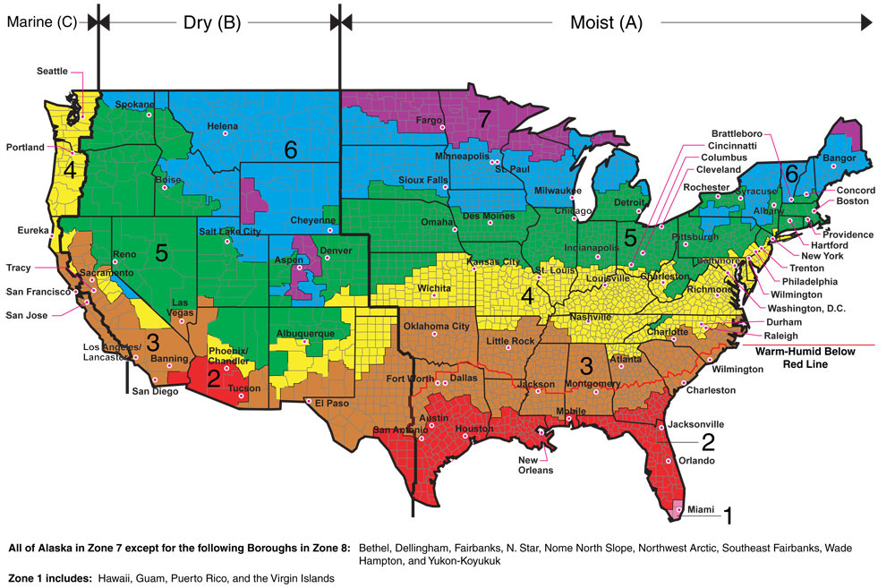
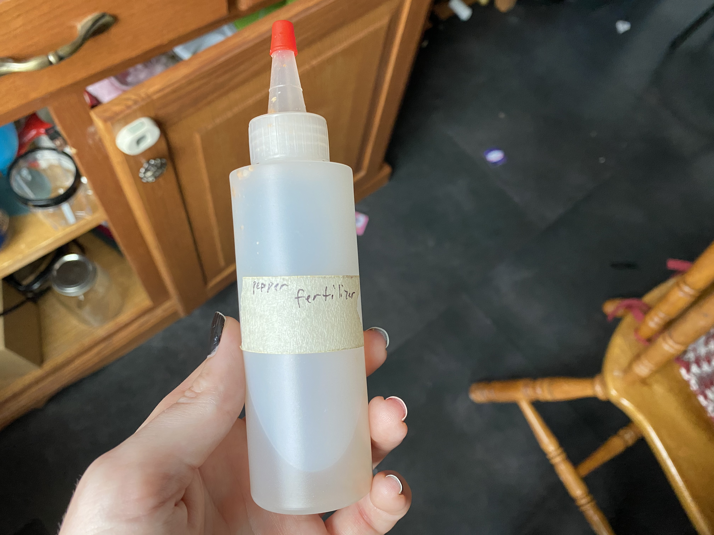

# Materials
-Jiffy seed pods

-Jiffy seed trays

-Seed varieties you'd like to grow

-A sunny window

-Heating pad (optional)

-Grow tent (optional)

-UV grow light (optional)

## Know Before You Go
Look at a good climate map and figure out what "zone" you're in. Knowing what zone your in will help you make good
choices about what you'll need to do with your plants to best care for them. 

### Buy What You Like
If you're new to growing peppers, buy what you like! Growing peppers from seed takes a lot of time and effort.
Don't put all that work into something that you ultimately won't use (maybe because it's too hot, or not a flavor
you can work with.) So do a little research before you buy your seeds and plan what you want to raise for the year.

### Buyer Beware
If you want to grow superhots, be careful about buying seeds from inauthentic sources. There are some sellers who 
will sell mystery seeds and claim that they are superhots. They tend to be cheaper, but you'll be disappointed by 
what you end up getting when the plants are fully grown.

# Germination
Jiffy seed pods and Jiffy seed trays are effective in getting seeds to germination. Give the seeds a sunny spot 
(a sunny window works great) and let them get as much sunlight as possible. The most important thing for germination
is to make sure that the trays are kept warm. Once the seeds begin to sprout, they will need continuous sunlight.

Realistically, you shouldn't need to open up the trays much before the seedlings are ready to get re-potted.

Germination for superhot seeds takes a long time. Depending on many factors, you may not see growth for many
months. Be patient while the seeds open, and don't assume the seeds are duds until they've been planted for at
least 3 months with no progress.

## Watering
Watering during germination isn't critical. The water used during the initial hydration of the seed starters
should be enough to keep the soil healthy enough to sustain the seeds through to first sprouting.

## Labeling
Seed trays are also good for keeping track of what varieties you have planted. 

# First Sprout
Once the seeds begin to sprout, they'll have a few more needs right. Make sure the clear plastic top stays on the
top of the trays as much as possible. Peppers like sunlight and humidity, give them as much of both as you can.

It's important not to overewater the newly sprouted seeds. It'll be tempting to do this, but with the lid on, the
water stays in as a closed system.

Your first sprout should come with two starter leaves. These two leaves help separate the stem from the seed
casing and provide the first bit of photosynthesis for your beloved little death bringers. At a certain point,
these leaves give less and less to the baby pepper plant as new leaves come in.

Keep track of the leaf count in your plants so that you can track where their maturity is.

## Watering
Keeping the plants well watered is important throughout the lifecycle of your plants, but making sure that the 
water level is just right can be challenging for new growers. Your plants should be well drained so that you
don't get water buildup around the roots. If this happens, you'll start to notice changes in the way  your plant
grows which may include some drooping or yellowing of the leaves.

# Seedling
After a few weeks, you should be watching your plants grow from sprouts to seedlings. The care routines in this
stage will be a bit different.

## Fertilizing
At a certain level of maturity, fertilizing your seedling will become an option. You shouldn't need to worry about
this until your seedling has around 7 or 8 leaves. You may choose not to use fertilizer at this stage, and that's
okay. If you do decide to go the fertilizer route in the seedling stage, you'll want a fertilizer that will
promote well-rounded growth. 10-10-10 fertilizer is what you'll want for this. There are two different types to
consider, solid and liquid. Both end up as liquid ultimately though.

If you decide to get solid fertilizer, mix 1tbsp of fertlizer in 1 cup of water. Let the mixture sit, and shake
it before you put it on your plants. Avoid getting any fertilizer on the leaves, and instead put a few drops into
the soil around the stem of the plant once every few days.

### Additional Warning On Fertilizer
Avoid getting fertilizer anywhere near the leaves of your plant at all cost. Fertilizer can burn the leaves and
set back your growth if you aren't careful with the concentrations.  

# Moving Into The First Pot
Your lovely little killers will outgrow its little seed starter home and need to be moved to a larger container.
You'll be able to tell when this time comes by paying attention to root growth inside the seed starter pod. If you
start to see roots growing out of the sides of the seed starter, your seedling is past due to be moved into a new
home. At this point, you'll have more decisions to make.

Some growers choose to move through a graduated series of pots, while others choose to plant maturing seedlings
directly into a larger container that will bring them into full maturity. (I use the graduated pot method because
you never know how big your plants will get, or how fast, it makes them easier to move, and I don't mind the extra
work involved in re-potting the plants every so-often.)

When you do move your plant into the first pot, be sure to remove any material that may be holding the seed pod
together. All this netting or cloth will do is restrict your root growth and that will slow down the speed that
you'll notice growth in your plants.

## Standard Small Pots (graduated method)
Depending on who you  talk to, you'll hear people swear by one type of pot over another. I have used peat-based
pots the last two years and have generally been pretty happy with the results. Other growers don't like peat pots
because they have a tendency to leach moisture out of the soil. This is true, and keeping seedlings at the right 
water levels can be a bit challenging with them. I will also admit that they also tend to get soggy after a while
and degrade quickly. I like them because they're biodegradeable and I can re-use them at later stages of growing.

Other growers use the "double cup" method of putting seedlings into a dirt-filled solo cup, poking holes in the
bottom of the first cup, and then putting the first cup into a second cup. This helps control drainage, I've seen
this approach be at least as effective as peat pots.

I'm sure there are other ways to approach the first pot, but these are two of the most effective I've personally
seen. Find what works for you!

# Post-First-Pot-Care
Once your seedlings are in their first pot, care becomes a bit more intensive. You should start to see more stem
and leaf growth now that the plant has more space to grow.

# Mature Plant Care

## Pollination

# Overwintering

# Topping

# Seed Harvesting
