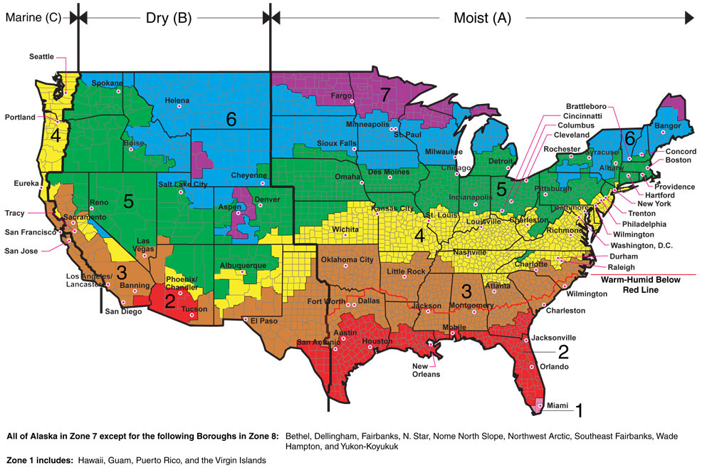

# Materials
-Jiffy seed pods

-Jiffy seed trays

-Seed varieties you'd like to grow

-A sunny window

## Know Before You Go
Look at a good climate map and figure out what "zone" you're in. Knowing what zone your in will help you make good
choices about what you'll need to do with your plants to best care for them. 

### Buy What You Like
If you're new to growing peppers, buy what you like! Growing peppers from seed takes a lot of time and effort.
Don't put all that work into something that you ultimately won't use (maybe because it's too hot, or not a flavor
you can work with.) So do a little research before you buy your seeds and plan what you want to raise for the year.

### Buyer Beware
If you want to grow superhots, be careful about buying seeds from inauthentic sources. There are some sellers who 
will sell mystery seeds and claim that they are superhots. They tend to be cheaper, but you'll be disappointed by 
what you end up getting when the plants are fully grown.

# Germination
Jiffy seed pods and Jiffy seed trays are effective in getting seeds to germination. Give the seeds a sunny spot 
(a sunny window works great) and let them get as much sunlight as possible. The most important thing for germination
is to make sure that the trays are kept warm. Once the seeds begin to sprout, they will need continuous sunlight.

Realistically, you shouldn't need to open up the trays much before the seedlings are ready to get re-potted.

## Labeling
Seed trays are also good for keeping track of what varieties you have planted. 

# First Sprout
Once the seeds begin to sprout, they'll have a few more needs right. Make sure the clear plastic top stays on the
top of the trays as much as possible. Peppers like sunlight and humidity, give them as much of both as you can.

It's important not to overewater the newly sprouted seeds. It'll be tempting to do this, but with the lid on, the
water stays in as a closed system.

Your first sprout should come with two starter leaves. These two leaves help separate the stem from the seed
casing and provide the first bit of photosynthesis for your beloved little death bringers. At a certain point,
these leaves give less and less to the baby pepper plant as new leaves come in.

Keep track of the leaf count in your plants so that you can track where their maturity is.

# Seedling
After a few weeks, you should be watching your plants grow from sprouts to seedlings. The care routines in this
stage will be a bit different.

## Fertilizer
At a certain level of maturity, fertilizing your seedling will become an option. You shouldn't need to worry about
this until your seedling has around 7 or 8 leaves. You may choose not to use fertilizer at this stage, and that's
okay. If you do decide to go the fertilizer route in the seedling stage, you'll want a fertilizer that will
promote well-rounded growth. 10-10-10 fertilizer is what you'll want for this. There are two different types to
consider, solid and liquid. Both end up as liquid ultimately though.

If you decide to get solid fertilizer, mix 1tbsp of fertlizer in 1 cup of water. Let the mixture sit, and shake
it before you put it on your plants. Avoid getting any fertilizer on the leaves, and instead put a few drops into
the soil around the stem of the plant once every few days.

### Additional Warning On Fertilizer
Avoid getting fertilizer anywhere near the leaves of your plant at all cost. Fertilizer can burn the leaves and
set back your growth if you aren't careful with the concentrations.  

# Potting
Your lovely little killers will outgrow its little seed starter home and need to be moved to a larger container.
You'll have more decisions to make at this point. There are no wrong answers when it comes to potting your plant.

## Standard pots

# Overwintering

# Topping
